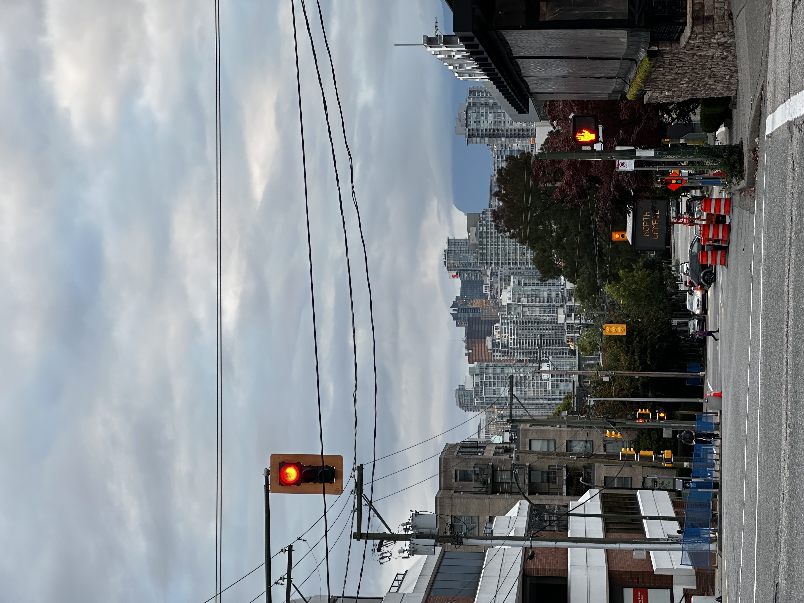

One of the best parts of starting at UBC has been discovering Vancouver beyond the classroom. The city has a way of shifting quickly: quiet streets, mountain views, seawall walks, and busy neighbourhoods all seem to sit close together.

I’m slowly building a personal map of the places that make the city feel distinct. A walk through a new neighbourhood can turn into an afternoon of people-watching, good food, and noticing details I would have missed if I had stayed on my usual route.

There is still a lot left to explore, but that feels like part of the fun. For now, I’m learning the city one walk at a time.

