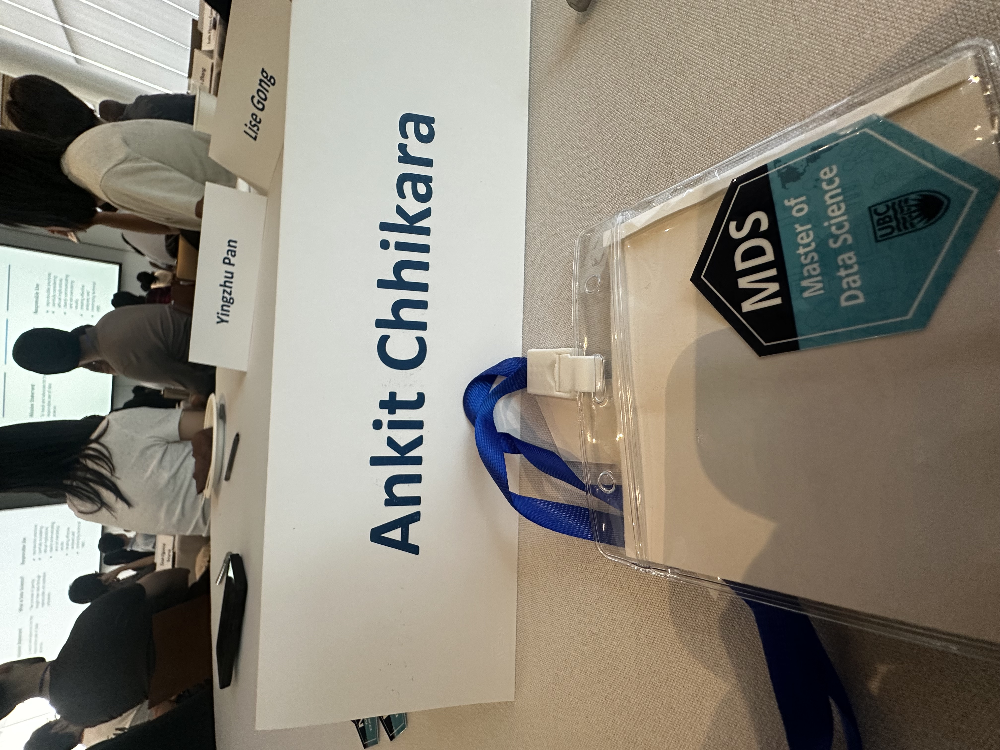

Starting the UBC Master of Data Science program has felt like stepping into motion. There is a new rhythm to learn: new people, new tools, and a lot of questions arriving faster than answers.

The first weeks have been a mix of orientation, first classes, and the quieter work of finding a routine. What surprised me most is how quickly a broad field becomes personal once you start asking which problems you want to spend time with.

I’m still at the beginning, but I’m trying to pay attention to the process as much as the output. This journal is a place to keep those observations close.

